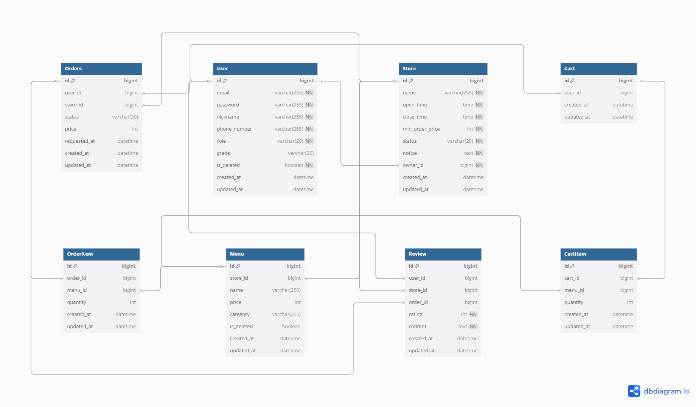

# 🆘 배달 구조대
본 프로젝트는 음식 주문 및 리뷰 서비스를 제공하는 백엔드 서버로,  
회원, 가게, 메뉴, 장바구니, 주문, 리뷰 기능과 사장용 대시보드 기능을 포함하고 있습니다.  
Spring Boot와 JPA 기반으로 개발되었으며, RESTful API 아키텍처를 준수합니다.  

<br>

## 기술 스택
- Java 17
- Spring Boot 3.4.4
- Spring Data JPA
- Spring Validation
- MySQL
- QueryDSL 5.0.0
- JWT(Json Web Token) 기반 인증
- BCrypt 비밀번호 암호화
- Gradle
- Lombok

<br>

## 팀원별 주요 담당 기능
- **홍이랑 (팀장)**
  - **가게**: 가게 등록, 조건 기반 목록 조회, 상세 조회, 정보 변경, 삭제(폐업)
  - **대시보드**: 사용자별/가게별 일간/월간 고객 수, 주문 수, 매출 조회
  - **예외 처리 구현**: 전역 예외 처리 및 커스텀 예외 대응 
- **박한비**
  - **회원**: 권한별 회원가입, 로그인, 정보 조회 및 변경, 비밀번호 검증, 임시 비밀번호 발급, 탈퇴
  - **예외 처리 전략**: 사용자 정의 예외 코드 관리
- **이관희**
  - **메뉴**: 메뉴 등록, 가게별/카테고리별 메뉴 조회, 메뉴 정보 수정, 메뉴 삭제
  - **예외 처리 전략**: 사용자 정의 예외 코드 관리
- **이혜원**
  - **리뷰**: 리뷰 작성, 평점별 리뷰 조회, 리뷰 수정, 리뷰 삭제
  - **예외 처리 전략**: 사용자 정의 예외 코드 관리
- **임지윤**
  - **장바구니**: 장바구니 항목 추가, 조회, 수정, 삭제
  - **주문**: 주문 등록, 내 주문 목록 조회, 단건 조회, 관리자 조회, 주문 취소 
  - **예외 처리 전략**: 사용자 정의 예외 코드 관리

<br>

## 프로젝트 구조

```
team.project.sos
├── common
│   ├── config
│   ├── exception
│   ├── response
│   ├── security
├── domain
│   ├── auth
│   ├── cart
│   ├── dashboard
│   ├── menu
│   ├── order
│   ├── review
│   ├── store
│   ├── user
```

<br>

## ERD


<br>

## 기능 명세서

📄 [**기능 명세서 - 사용자**](docs/user.md)  
📄 [**기능 명세서 - 메뉴**](docs/menu.md)  
📄 [**기능 명세서 - 주문/장바구니**](docs/cart_order.md)  
📄 [**기능 명세서 - 가게/대시보드**](docs/store_dashboard.md)  
📄 [**기능 명세서 - 리뷰**](docs/review.md)  

<br>

## API 명세서
